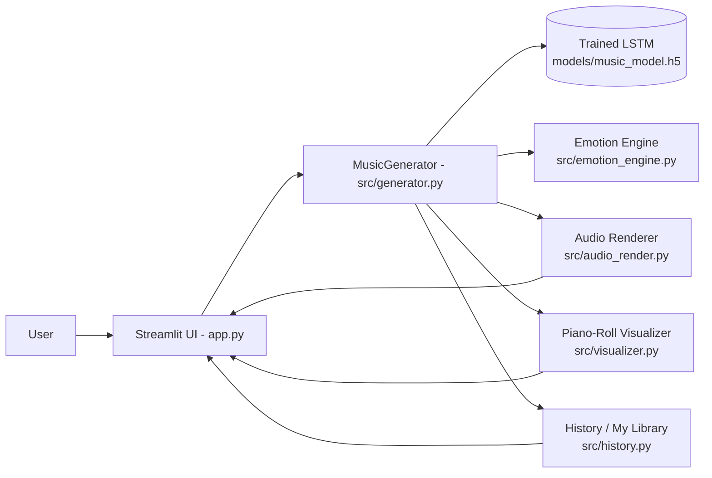
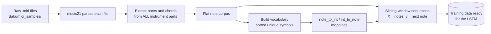
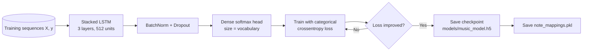
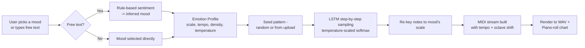
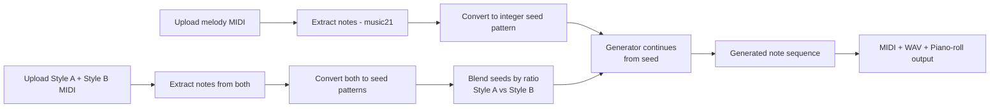
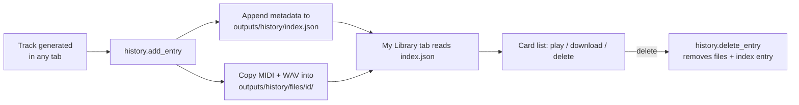

# 🎵 SynthMuse

**An emotion-aware AI music composer** — turn a mood, a hummed melody
fragment, or two different musical styles into an original, playable,
downloadable composition. Built on an LSTM generative core (TensorFlow /
Keras + music21) and wrapped in a Streamlit studio interface with a
persistent track library.

🔗 **Live demo:** _[add your deployed URL here once deployed — see Deployment section below]_

---

## ✨ Features

| Feature | What it does |
|---|---|
| 🧠 **Emotion Engine** | Pick a mood (or type a sentence) and the app maps it to real musical controls — scale/mode, tempo, note density, and sampling temperature. |
| ✍️ **Finish My Melody** | Upload your own short MIDI idea and SynthMuse analyzes it and composes a continuation in a matching style. |
| 🧬 **Music DNA Mixer** | Upload two reference MIDI files and blend them (adjustable ratio) into one hybrid seed, producing a genuinely new hybrid piece. |
| 📚 **My Library** | Every generated track is automatically saved (MIDI + WAV + metadata) and persists across app restarts. |
| 🎹 **Live Piano-Roll Visualizer** | See the generated melody as an interactive, mood-colored piano roll. |
| 🔊 **In-Browser Playback** | MIDI is rendered to WAV automatically (FluidSynth if available, pure-Python synth fallback otherwise). |
| 🎼 **Sheet Music Export** | One-click MusicXML export for MuseScore, Finale, Sibelius. |

---

## 🏗️ Architecture

### 1. System overview



### 2. Data preprocessing pipeline



### 3. Model training pipeline



### 4. Emotion-driven generation flow



### 5. Finish My Melody / Music DNA Mixer flow



### 6. My Library persistence flow



---

## 📂 Project Structure

See [`structure.txt`](structure.txt) for the full annotated folder tree.

---

## ⚙️ Installation

```bash
git clone https://github.com/Kaweri05/SynthMuse.git
cd SynthMuse
python -m venv venv
source venv/Scripts/activate      # Windows Git Bash. Use venv/bin/activate on macOS/Linux
pip install -r requirements.txt
```

> Optional, for higher-fidelity audio playback: install
> [FluidSynth](https://www.fluidsynth.org/) and a General MIDI soundfont
> (e.g. `FluidR3_GM.sf2`). Without it, SynthMuse automatically falls back
> to a built-in sine-wave synthesizer.

### Bring your trained model

Copy `music_model.h5` and `notes.pkl` into `models/`, then generate the
mapping file the app also needs:

```bash
python -m src.data_preprocessing
```

### Or train from scratch

Drop `.mid` files into `data/midi_samples/`, then:

```bash
python -m src.train --epochs 100 --batch-size 64
```

### Run the app

```bash
streamlit run app.py
```

See [`notes.txt`](notes.txt) for fixes to common setup issues (Keras
version mismatches, Windows DLL blocks, slow generation, etc.).

---

## 📖 User Guide

**🎼 Compose by Mood**
1. Choose "Pick a mood" (select from a list) or "Describe it in words" (type a sentence — SynthMuse infers the mood).
2. Adjust length (notes) and base tempo (BPM).
3. Click **Generate**. Listen in-browser, view the piano roll, and download MIDI / WAV / MusicXML.

**✍️ Finish My Melody**
1. Upload a short `.mid` file — something you hummed or wrote.
2. Pick a mood to steer the continuation and how many extra notes to add.
3. Click **Continue Composing**. The output extends your original melody, not a random one.

**🧬 Music DNA Mixer**
1. Upload two different `.mid` reference files (Style A and Style B).
2. Set the blend ratio (0 = fully Style A, 1 = fully Style B) and a mood.
3. Click **Fuse & Generate** for a hybrid piece carrying traits of both.

**📚 My Library**
- Every track generated in the three tabs above is automatically saved here.
- Filter by which feature created it, play tracks inline, download MIDI/WAV, or delete individual tracks.
- Use **Clear Library** to wipe all saved tracks and start fresh.

---

## 🚀 Deployment

### ⚠️ Important: Vercel is not a good fit for this project

If you're planning to deploy SynthMuse on **Vercel**, know this upfront:
**it will very likely fail to deploy**, for several concrete reasons:

1. **Vercel serverless functions have a hard size limit** (250 MB
   uncompressed for the function bundle). TensorFlow alone is well over
   that on its own — a full `tensorflow` install is typically
   400–700+ MB. Your deployment will fail at the build/upload step
   before your code even runs.
2. **Vercel is built for Next.js / frontend + lightweight serverless
   APIs**, not long-running Python web apps like Streamlit. Streamlit
   needs a persistent server process (WebSocket connection for live
   reruns) — that model doesn't fit Vercel's request/response serverless
   execution at all.
3. **Cold-start + execution time limits.** Even if you shrank the
   dependencies enough to deploy, Vercel functions time out (10s on the
   free Hobby plan, up to 60s on Pro) — loading a Keras model and
   running LSTM inference will frequently exceed that.

**If you see errors like these, this is why:**
```
Error: A Serverless Function has exceeded the unzipped maximum size of 250 MB
```
```
Error: This Serverless Function has timed out.
```

### ✅ Platforms that actually work for this project

| Platform | Why it fits |
|---|---|
| **[Streamlit Community Cloud](https://streamlit.io/cloud)** | Built specifically for Streamlit apps, free tier, reads `requirements.txt` directly, no size limit issue like Vercel's. Easiest option — just connect your GitHub repo. |
| **[Hugging Face Spaces](https://huggingface.co/spaces)** (Streamlit SDK) | Free tier, designed for ML demos, handles large model files well (can also use Git LFS for `.h5` files). |
| **[Render](https://render.com/)** | Deploys as a persistent web service (not serverless), no 250 MB function limit, supports long-running Python processes. |
| **[Railway](https://railway.app/)** | Similar to Render — container-based, persistent process, good for TensorFlow apps. |

**Recommended: Streamlit Community Cloud.** Steps:
1. Push this repo to GitHub (public or with Streamlit Cloud's GitHub access).
2. Go to share.streamlit.io → "New app" → select your repo, branch, and `app.py` as the entry point.
3. Since `models/*.h5`/`*.pkl` are gitignored by default, either remove them from `.gitignore` for this repo (if the files aren't too large for GitHub, <100 MB) or use **Git LFS** for the model file.
4. Deploy — Streamlit Cloud installs everything from `requirements.txt` automatically.

Once deployed, update the **Live demo** link at the top of this README.

### If you must use Vercel anyway

The only realistic path is splitting the project in two:
- Host the **Streamlit/TensorFlow app** on one of the platforms above (Render/Hugging Face/Streamlit Cloud) as the actual inference backend.
- Use Vercel only for a **separate lightweight frontend** (e.g. a Next.js landing page) that calls your hosted app via an API or iframe.
Trying to run TensorFlow directly inside a Vercel serverless function is not a workaround that reliably works at this dependency size — plan for a different host for the ML part.

---

## 🛠️ Tech Stack

- **Language:** Python
- **Deep Learning:** TensorFlow / Keras (stacked LSTM)
- **Music parsing/rendering:** music21, pretty_midi
- **UI:** Streamlit
- **Visualization:** Plotly (interactive piano roll)

---

## 🎯 Applications

- AI-assisted composition and songwriting sketches
- Mood-based background music for games, videos, or apps
- Music education / algorithmic composition demos
- Rapid style exploration by blending reference tracks

---

## 🔮 Future Enhancements

- Multi-instrument / full orchestration (auto-generate bass, strings, drums layers)
- Real-time streaming generation (jam-along mode)
- Evaluation metrics dashboard (perplexity, note-density comparisons vs. training corpus)
- Transformer-based generation as an alternative to the LSTM, with a side-by-side comparison
- Containerized deployment (Dockerfile) for fully reproducible environments

---

## 👨‍💻 Author

**Kaweri Harinkhede** — Computer Engineering Student, passionate about
AI, Machine Learning, and Web Development.

---

## 📜 License

This project is developed for educational and learning purposes. See
[LICENSE](LICENSE) (MIT).
