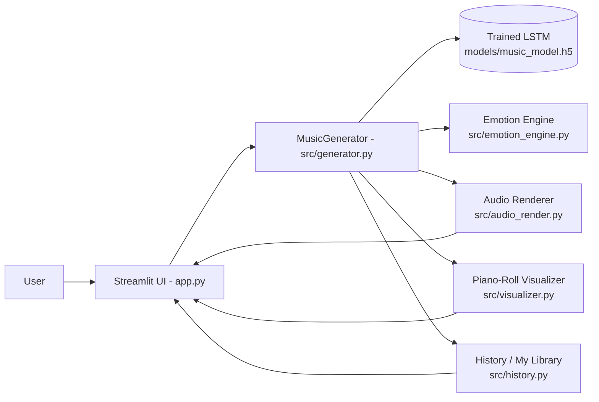
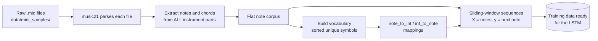
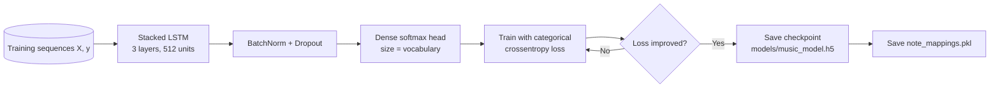
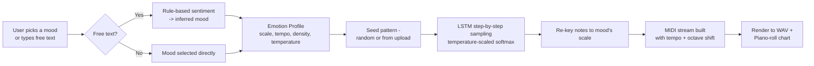
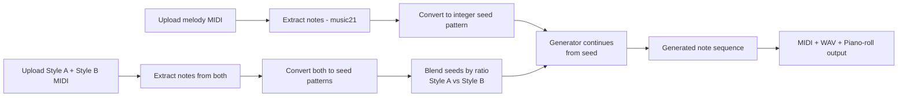
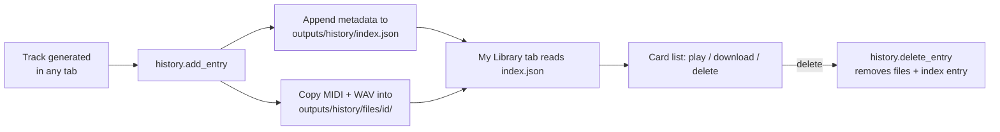

<div align="center">

# 🎵 SynthMuse

### An emotion-aware AI music composer, built end-to-end and deployed live.

Turn a mood, a hummed melody fragment, or two different musical styles
into an original, playable composition — powered by a custom-trained
LSTM neural network.

[](https://huggingface.co/spaces/cleve05/Synthmuse)
[](https://www.python.org/)
[](https://www.tensorflow.org/)
[](https://streamlit.io/)
[](LICENSE)

**[▶ Try it live](https://huggingface.co/spaces/cleve05/Synthmuse)** · [Features](#-features) · [Architecture](#%EF%B8%8F-architecture) · [Skills Demonstrated](#-skills-demonstrated) · [Run Locally](#%EF%B8%8F-installation-run-it-locally)

</div>

---

## 🎯 What is this, in one line

SynthMuse is a deep-learning web app that composes original instrumental
music conditioned on emotion — you tell it a mood (or describe one in a
sentence), and a trained neural network generates a unique piece of
music in that mood, playable instantly in the browser.

## 🧠 Why it's more than "another music generator"

Most open-source AI music generator projects stop at "train an LSTM,
sample it, export a MIDI file." This one goes further, with three
original features layered on top of that core:

- **Emotion Engine** — translates a mood or a typed sentence into real
  musical parameters (scale, tempo, note density, sampling temperature)
  instead of generating blindly.
- **Finish My Melody** — continues a melody *you* uploaded, rather than
  only ever starting from a random seed.
- **Music DNA Mixer** — blends two different reference tracks into one
  new hybrid composition, with a user-controlled blend ratio.

Plus a persistent **My Library**, live piano-roll visualization,
in-browser audio playback, and sheet-music (MusicXML) export — the kind
of product-level polish most similar student/portfolio projects skip.

---

## ✨ Features

| Feature | What it does |
|---|---|
| 🧠 **Emotion Engine** | Pick a mood (or type a sentence) and the app maps it to real musical controls — scale/mode, tempo, note density, and sampling temperature. |
| ✍️ **Finish My Melody** | Upload your own short MIDI idea and SynthMuse analyzes it and composes a continuation in a matching style. |
| 🧬 **Music DNA Mixer** | Upload two reference MIDI files and blend them (adjustable ratio) into one hybrid seed, producing a genuinely new hybrid piece. |
| 📚 **My Library** | Every generated track is automatically saved (MIDI + WAV + metadata) and persists across app restarts. |
| 🎹 **Live Piano-Roll Visualizer** | See the generated melody as an interactive, mood-colored piano roll. |
| 🔊 **In-Browser Playback** | MIDI is rendered to WAV automatically (FluidSynth if available, pure-Python synth fallback otherwise). |
| 🎼 **Sheet Music Export** | One-click MusicXML export for MuseScore, Finale, Sibelius. |

---

## 💼 Skills Demonstrated

*(For recruiters/hiring managers scanning this quickly)*

| Area | Demonstrated by |
|---|---|
| **Machine Learning** | Designed and trained a stacked LSTM (3 layers, 512 units) from scratch for sequence generation; understands sampling temperature, softmax, and vocabulary-based tokenization. |
| **Software Engineering** | Structured a real Python package (`src/`) with clear separation of concerns — config, preprocessing, model, training, generation, and UI are all independently testable modules. |
| **Product Thinking** | Went beyond a bare model demo to build three genuinely differentiated user-facing features (Emotion Engine, Finish My Melody, Music DNA Mixer) plus persistence (My Library). |
| **Full-Stack Delivery** | Built the front end (Streamlit + custom CSS theming), back end (model inference pipeline), and shipped it as a live, publicly accessible product. |
| **DevOps / Deployment** | Debugged and resolved real production issues: Keras version incompatibilities, Windows Application Control DLL blocks, dependency conflicts, and containerized deployment via Docker on Hugging Face Spaces. |
| **Debugging & Problem-Solving** | See [Engineering Challenges Solved](#-engineering-challenges-solved) below — a real log of non-trivial bugs found and fixed. |

---

## 🏗️ Architecture

### 1. System overview
*How the pieces fit together: the UI calls the generator, which uses the trained model, the emotion engine, and renders output back to the browser.*



### 2. Data preprocessing pipeline
*Turning raw MIDI files into training data the model can learn from.*



### 3. Model training pipeline
*How the neural network itself is built and trained.*



### 4. Emotion-driven generation flow
*The core differentiator — how a mood becomes music.*



### 5. Finish My Melody / Music DNA Mixer flow
*How the two "continue or blend" features reuse the same generation core.*



### 6. My Library persistence flow
*How generated tracks are saved and survive app restarts.*



---

## 🐛 Engineering Challenges Solved

Real issues hit and fixed while building and deploying this project —
kept here as evidence of hands-on debugging, not just following a
tutorial:

- **Keras version incompatibility** — a model saved under one Keras
  major version failed to deserialize under another (`quantization_config`
  / `batch_shape` errors). Solved by retraining in a pinned, matching
  environment (`tensorflow==2.16.2`, `tf_keras==2.16.0`) rather than
  chasing loader compatibility indefinitely.
- **Silent training failure (vocabulary size: 0)** — root-caused to the
  preprocessing code only reading the first MIDI instrument track;
  fixed by iterating over *all* parts returned by `music21`.
- **Windows "Application Control" DLL blocks** — diagnosed a
  policy-level block on TensorFlow's compiled binaries (aggravated by
  running inside a OneDrive-synced folder) and resolved it by relocating
  the project and rebuilding the virtual environment outside cloud-sync
  paths.
- **Dependency resolution conflicts** — pinned `tensorflow`, `tf_keras`,
  `protobuf`, and `ml_dtypes` to mutually compatible versions after a
  cascading pip conflict.
- **Slow inference** — switched from repeated `model.predict()` calls
  (high per-call overhead) to direct callable invocation
  (`model(x, training=False)`), meaningfully speeding up note-by-note
  generation.
- **Cloud deployment mismatch** — corrected an auto-generated Hugging
  Face Docker template (wrong Python version for the pinned TensorFlow
  release, wrong entry-point file, missing model/data folders in the
  Docker `COPY` instructions) to get a from-scratch project deploying
  cleanly as a Docker-based Streamlit Space.

Full running log in [`notes.txt`](notes.txt).

---

## 📂 Project Structure

See [`structure.txt`](structure.txt) for the full annotated folder tree.

---

## ⚙️ Installation (run it locally)

```bash
git clone https://github.com/Kaweri05/Synthmuse.git
cd Synthmuse
python -m venv venv
source venv/Scripts/activate      # Windows Git Bash. Use venv/bin/activate on macOS/Linux
pip install -r requirements.txt
```

> Optional, for higher-fidelity audio playback: install
> [FluidSynth](https://www.fluidsynth.org/) and a General MIDI soundfont
> (e.g. `FluidR3_GM.sf2`). Without it, SynthMuse automatically falls back
> to a built-in sine-wave synthesizer.

<details>
<summary><b>Bring your own trained model</b></summary>

Copy `music_model.h5` and `notes.pkl` into `models/`, then generate the
mapping file the app also needs:

```bash
python -m src.data_preprocessing
```
</details>

<details>
<summary><b>Or train from scratch</b></summary>

Drop `.mid` files into `data/midi_samples/`, then:

```bash
python -m src.train --epochs 100 --batch-size 64
```
</details>

### Run the app

```bash
streamlit run app.py
```

See [`notes.txt`](notes.txt) for fixes to common setup issues.

---

## 📖 User Guide

<details>
<summary><b>🎼 Compose by Mood</b></summary>

1. Choose "Pick a mood" (select from a list) or "Describe it in words" (type a sentence — SynthMuse infers the mood).
2. Adjust length (notes) and base tempo (BPM).
3. Click **Generate**. Listen in-browser, view the piano roll, and download MIDI / WAV / MusicXML.
</details>

<details>
<summary><b>✍️ Finish My Melody</b></summary>

1. Upload a short `.mid` file — something you hummed or wrote.
2. Pick a mood to steer the continuation and how many extra notes to add.
3. Click **Continue Composing**. The output extends your original melody, not a random one.
</details>

<details>
<summary><b>🧬 Music DNA Mixer</b></summary>

1. Upload two different `.mid` reference files (Style A and Style B).
2. Set the blend ratio (0 = fully Style A, 1 = fully Style B) and a mood.
3. Click **Fuse & Generate** for a hybrid piece carrying traits of both.
</details>

<details>
<summary><b>📚 My Library</b></summary>

- Every track generated in the three tabs above is automatically saved here.
- Filter by which feature created it, play tracks inline, download MIDI/WAV, or delete individual tracks.
- Use **Clear Library** to wipe all saved tracks and start fresh.
</details>

---

## 🚀 Deployment

**This project is live on [Hugging Face Spaces](https://huggingface.co/spaces/cleve05/Synthmuse)**, running as a Docker-based Streamlit Space with the trained model included directly in the repo.

<details>
<summary><b>How to redeploy / update the live Space</b></summary>

The Space is a separate git repository from this GitHub repo:

```bash
git clone https://huggingface.co/spaces/cleve05/Synthmuse hf-synthmuse
cd hf-synthmuse
# copy over updated app.py / src/ / models/ / data/ / .streamlit/ / requirements.txt
git add .
git commit -m "Update deployed app"
git push
```

The Space's `README.md` needs this YAML header for Hugging Face to build it correctly:
```yaml
---
title: SynthMuse
emoji: 🎵
colorFrom: purple
colorTo: indigo
sdk: docker
app_port: 8501
pinned: false
license: mit
---
```
</details>

> **Note on platform choice:** TensorFlow-based Streamlit apps need a
> platform running a persistent server process, not serverless functions
> with strict size/timeout limits. Hugging Face Spaces, Render, and
> Railway all work well here; serverless platforms built for frontend/
> lightweight APIs (e.g. Vercel) are not a good fit for this kind of app.

---

## 🛠️ Tech Stack

`Python` · `TensorFlow / Keras` · `music21` · `pretty_midi` · `Streamlit` · `Plotly` · `Docker` · `Hugging Face Spaces`

---

## 🔮 Future Enhancements

- Multi-instrument / full orchestration (auto-generate bass, strings, drums layers)
- Real-time streaming generation (jam-along mode)
- Evaluation metrics dashboard (perplexity, note-density comparisons vs. training corpus)
- Transformer-based generation as an alternative to the LSTM, with a side-by-side comparison
- GPU-backed hardware tier on Hugging Face for faster generation

---

## 👨‍💻 Author

**Kaweri Harinkhede**
Computer Engineering Student · AI/ML & Web Development

<!-- Add your actual links below -->
[GitHub](https://github.com/Kaweri05) · [LinkedIn](#) · [Portfolio](#)

---

## 📜 License

This project is developed for educational and learning purposes. See
[LICENSE](LICENSE) (MIT).
